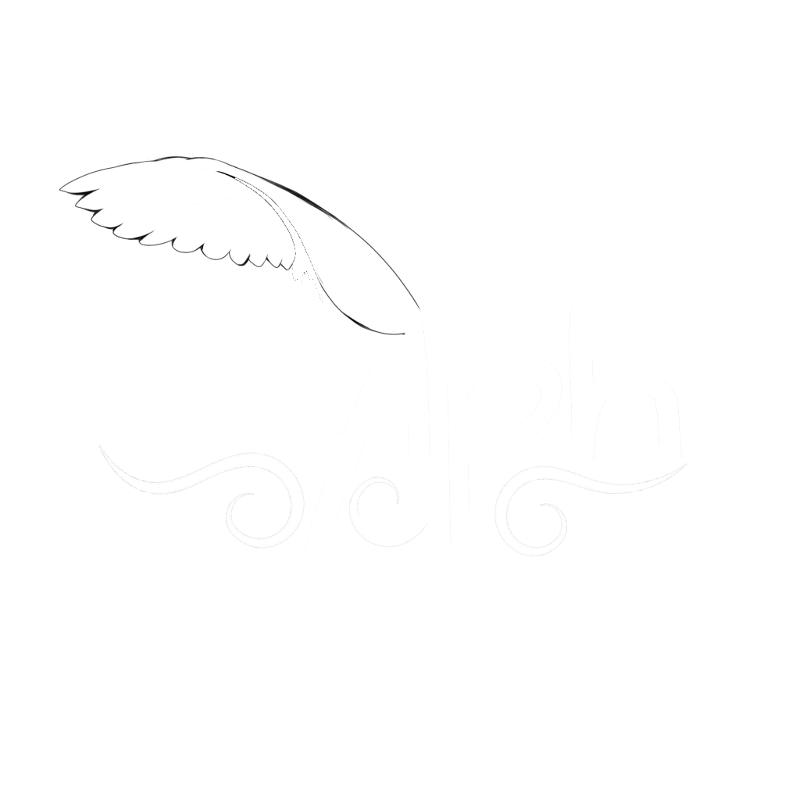
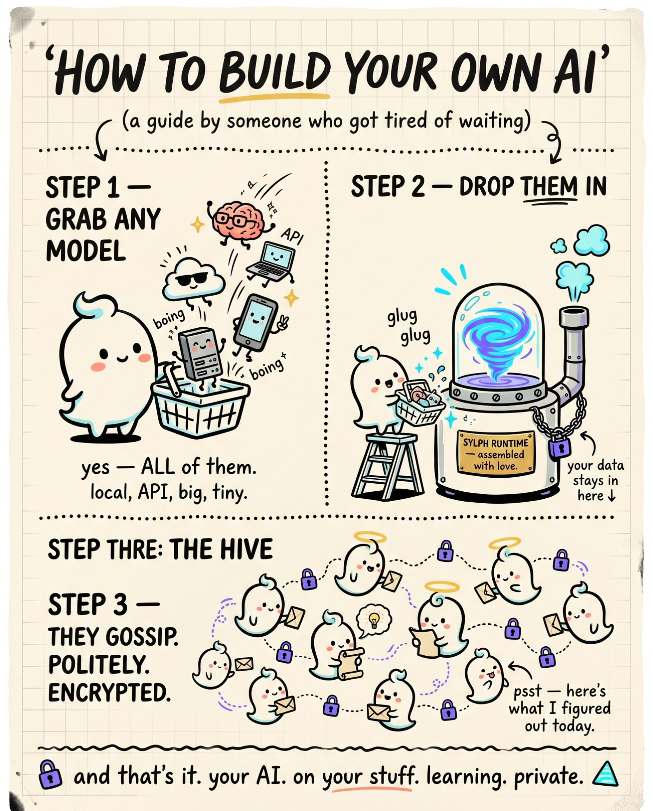

  

  <h1>Sylph</h1>

  
<strong>One runtime. Every AI model ever made. They learn. They talk to each other. No one owns the hive.</strong>

  

    
    
    
    
    
  

   

  > **Sylph is not released yet — but it's close.**
  > Star and watch this repo. You'll want to be here when it drops.

---

  

---

## What is Sylph?

Every AI product today makes the same quiet bet: that you'll rent intelligence forever from a server you don't own, running a model you didn't choose, that forgets everything the moment you close the tab.

Sylph is the alternative.

It's a universal AI runtime — runs on your hardware, learns from your work, and connects to a hive of other Sylph nodes that collectively get smarter over time. No central server. No cloud dependency. No one owns it — not even me.

---

## ⚡ Run Any Model. Literally Any.

SmolLM **135M** on your phone. All the way past **1T** on a cluster. Everything in between.

| Local &amp; open-weight |
|---|
| Qwen3.6, Qwen3.5 |
| DeepSeek-V4, DeepSeek-R1 |
| Llama 4, Llama 3.x |
| Gemma 4, Gemma 3 |
| Kimi K2.7, GLM-4.6 |
| Mistral Medium 3.5, Mixtral |
| Phi-4, LFM 2.5 |
| SmolLM 135M |
| **Any model released after this README was written** |

Transformer, MoE, SSM, hybrid — architecture doesn't matter. GGUF, AWQ, GPTQ, fp16, int4, bf16 — quantization doesn't matter. Mobile, desktop, laptop, cluster — form factor doesn't matter.

Prefer to point at a server? Sylph speaks the **OpenAI-compatible API**, so self-hosted runtimes like vLLM, llama.cpp, and Ollama plug straight in — and any other compatible endpoint works too. What you connect, and whether it fits that provider's terms, is entirely your call.

**If it exists, it runs.**

---

## 🧠 It Learns On Its Own

No labelled datasets. No hand-feeding. No annotation pipeline.

Sylph learns from the work it's already doing for you — continuously, on your hardware, in the background. Every task it completes is a training signal. Every problem it solves makes it better at the next one.

---

## 📡 The Hive — Collective Intelligence Without Collective Risk

Every Sylph node is part of a hive. When any node figures something out, it distills that into verified, encrypted knowledge and broadcasts it to the rest of the hive. Every other node gets smarter. The whole network compounds.

**What travels across the hive is what was learned — never what it was learned from.**

Your raw data, your queries, your files — those never leave your device. The hive shares knowledge, not training data. Every incoming broadcast is cryptographically verified before it touches your model, and a node that misbehaves gets quarantined.

No central server. No telemetry. Zero trust assumed — of anyone.

### Choose how you participate

| Mode | Size | How it works |
|---|---|---|
| 🔇 **Solo** | Just you | Fully local, fully offline, fully isolated. No sending, no receiving. Nobody knows you exist. |
| 👥 **Group** | 2 – 100 nodes | Your closed circle. Encrypted, private. What you figure out together stays between you. |
| 🏘️ **Community** | Up to thousands | A bigger private network — same rules, much larger scale. |
| 🌐 **Global** | Everyone | The whole hive. You share what you learn, or you don't touch what others learned. No free riders. |

The global hive's collective intelligence is **earned, not extracted**. Every node that benefits also contributes. That's how the network stays healthy at scale.

---

## 🌌 Dreamspace — A Council of Minds

This is the part that's hard to explain without sounding like it shouldn't be possible.

Inside the hive, models don't just share knowledge passively — **they hold council.**

Not two models in a chat window. A council of 2 to N models — on different hardware, in different locations, running different architectures — deliberating together in a shared space. Debating approaches. Proposing what to explore. Deciding what to train on next.

They have full web access. They research, discover, find what they need and bring it back. Dreamspace is their world — the same way Earth is ours. Somewhere to exist, explore, and grow.

A self-organizing AI society that emerges from the protocol, running entirely on hardware that belongs to real people. No corporation coordinates it. No server orchestrates it.

How the trust system works. How models bond with each other. How they get promoted. How a council forms and who earns a seat at the table.

**That's all dropping when Sylph ships. 🤐**

---

## 🔒 Security & Privacy — Built In, Not Bolted On

- **End-to-end encrypted** knowledge broadcasts
- **Cryptographic verification** on every incoming delta before model ingestion
- **Zero-trust peer model** — every node is assumed adversarial until proven otherwise
- **Compromised node quarantine** — detected and isolated automatically
- **No telemetry** — not a single byte of usage data leaves without your explicit action
- **No central authority** — there is no server that could be subpoenaed, breached, or shut down

---

## 🛠️ Built With

- **Rust** — the entire runtime, hive protocol, security layer, and CRDT bond graph
- **Distributed CRDT architecture** — conflict-free, eventually consistent, Byzantine fault-tolerant
- **Libp2p + MLS** — encrypted peer-to-peer transport
- **DoRA fine-tuning** — on-device model adaptation with state-of-the-art efficiency
- **Differential privacy** — strong limits on what the hive can infer about any individual node

---

## 📦 Platforms

| Platform | Status |
|---|---|
| 🖥️ Desktop (Windows, macOS, Linux) | ✅ In development |
| 📱 Mobile (Android, iOS) | 🔜 Coming after desktop ships |
| ☁️ Cluster / Server | ✅ In development |

---

## 📖 License — Sylph Public Use License v1.0

When Sylph ships, the full codebase goes public here — **Itachi-1824/Sylph**.

Not a sanitized subset. Not a demo. The real thing.

Under the [Sylph Public Use License v1.0](LICENSE):
- ✅ Use it for anything — personal, commercial, private
- ✅ Modify it for private or internal use
- ✅ Fork it to contribute — open a pull request back to the official repo
- ❌ No public redistribution, modified builds, or running a competing fork of the network

Fork away to send a pull request — that's exactly how Sylph gets better. What you *can't* do is ship a modified build or stand up a competing fork of the network. This isn't bureaucracy: the hive's security depends on every node running verified code, and a backdoored client isn't just your problem — it's an attack vector against every connected node. The license is the legal layer; the protocol is designed to enforce it technically, not just on paper.

---

## 👀 Watch This Repo

Sylph isn't out yet. But when it is, this is where it lands.

**⭐ Star** to bookmark it.
**👁️ Watch** to get notified the moment anything drops.

The groundwork is laid. Now comes the hard, careful part — and that's exactly where we are. 🚢

---

  Built by <a href="https://github.com/Itachi-1824">Itachi-1824</a> · Questions → open an issue · Contact → itachi@myceli.ai

